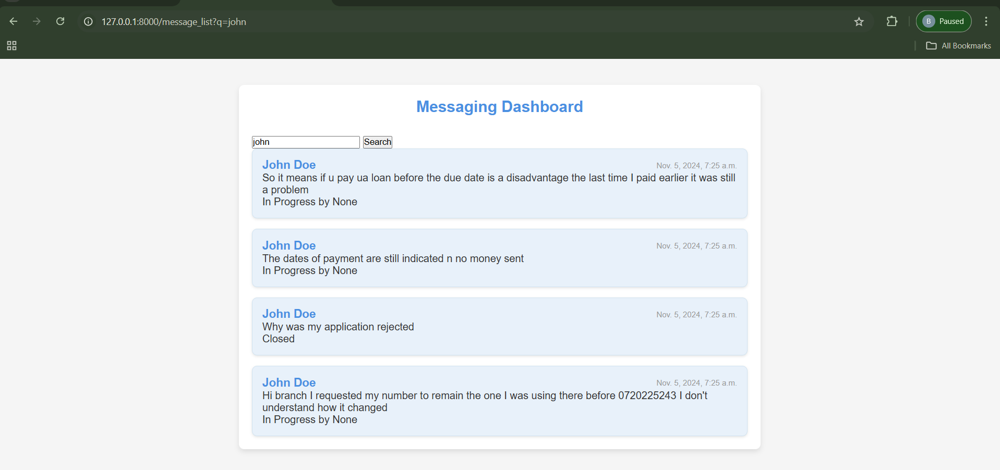
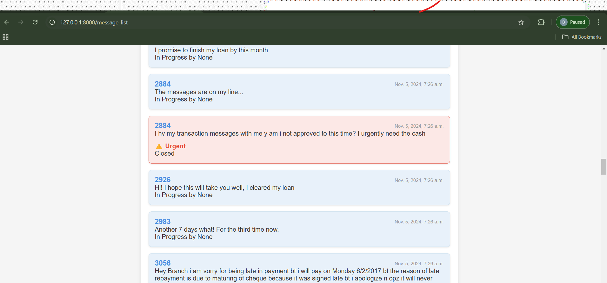
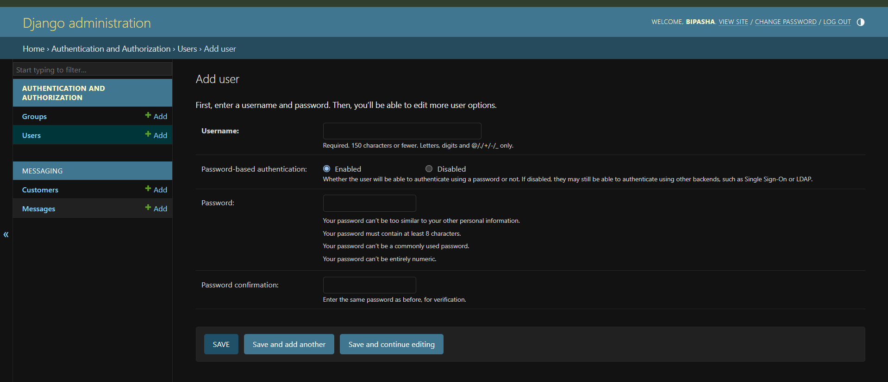

#Messaging App
This Django-based messaging application is designed for customer service agents to manage and respond to customer inquiries efficiently. It includes features like message prioritization, search, canned responses, and real-time updates using WebSockets.

Table of Contents
Features
Prerequisites
Installation
Usage
Screenshots
Video Walkthrough
Contributing
License
Features
Agent Dashboard: View, search, and manage customer messages.
Urgency Detection: Automatically flags high-priority messages based on keywords.
Search and Filtering: Find specific messages using keywords or customer names.
Canned Responses: Quickly respond to common inquiries.
Real-Time Updates: Receive new messages instantly with WebSocket support.
Message Assignment and Status: Track message status as "new," "in-progress," or "closed."
Prerequisites
Before you start, make sure you have the following installed:

Python 3.7+: Download Python
Git: Download Git
Virtualenv: Recommended for managing project dependencies in isolation
Installation
Follow these steps to set up the project on your local machine.

1. Clone the Repository
bash
Copy code
git clone https://github.com/yourusername/Messaging-App.git
cd Messaging-App
2. Set Up a Virtual Environment
Create and activate a virtual environment (optional but recommended):

Windows:

bash
Copy code
python -m venv env
env\Scripts\activate
macOS/Linux:

bash
Copy code
python3 -m venv env
source env/bin/activate
3. Install Required Packages
Install all necessary dependencies using pip:

bash
Copy code
pip install django djangorestframework channels channels-redis
This command installs Django and additional packages needed for API and WebSocket functionality.

4. Set Up the Database
Run the following commands to create migrations and apply them to set up the database:

bash
Copy code
python manage.py makemigrations
python manage.py migrate
5. Create a Superuser
To access the Django admin interface, create an admin user:

bash
Copy code
python manage.py createsuperuser
Follow the prompts to set a username, email, and password.

6. Start the Development Server
Run the Django development server:

bash
Copy code
python manage.py runserver
The application will be available at http://127.0.0.1:8000/.

Usage
Access the Admin Panel: Visit http://127.0.0.1:8000/admin and log in with the superuser credentials to manage data.
Agent Dashboard: Access the main messaging dashboard at http://127.0.0.1:8000/ to view, claim, and respond to messages.
Real-Time Updates: Messages are updated in real-time if WebSocket integration is active.
Respond to Messages: Use canned responses or manual replies to respond to messages. Claim messages and update their status from the dashboard.
Screenshots
Here are some screenshots of the application interface:

Dashboard Overview

Message List with Urgency Flags

Search Functionality

Respond to Message Interface

Admin

These screenshots showcase the key features of the application, including the dashboard, message list with urgency, search, and response interface.

Video Walkthrough
Watch the videos below for a comprehensive walkthrough of the application and its features:

Video 1: Application Overview and Setup
[Video Title]([https://link-to-video](https://www.loom.com/share/c688bd1d9b784d93abc647e5c62d3d77?sid=1c31f1f3-461a-41b4-b2f8-4d8738128586))

Video 2: Feature Demonstration and Usage
[Video Title]([https://link-to-video](https://www.loom.com/share/c688bd1d9b784d93abc647e5c62d3d77?sid=d5b1d78b-77dc-4129-9963-aa5da36e375a)
Contributing
If you would like to contribute:

Fork the repository.
Create a new branch (git checkout -b feature/AmazingFeature).
Commit your changes (git commit -m 'Add some AmazingFeature').
Push to the branch (git push origin feature/AmazingFeature).
Open a Pull Request.
License
This project is licensed under the MIT License.

